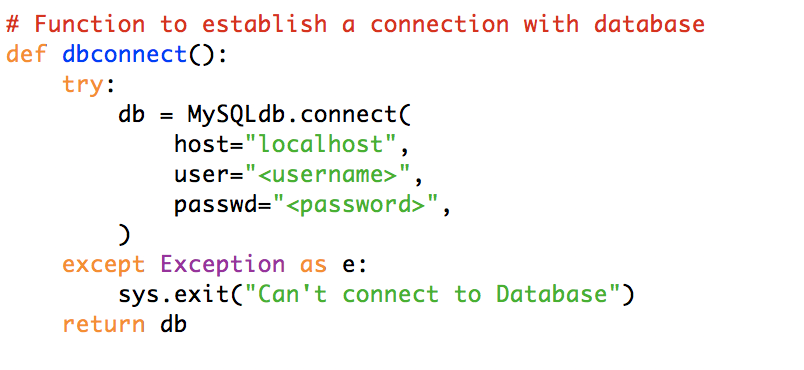
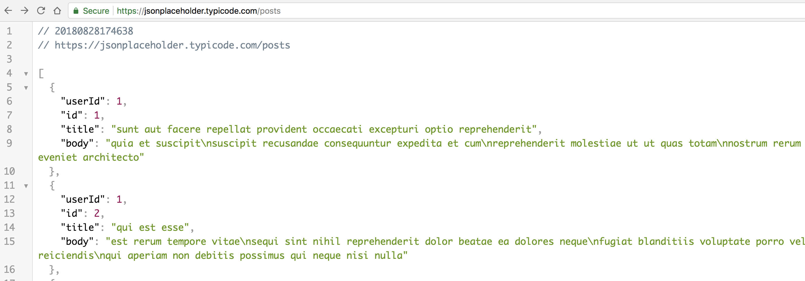
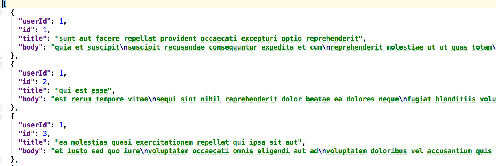
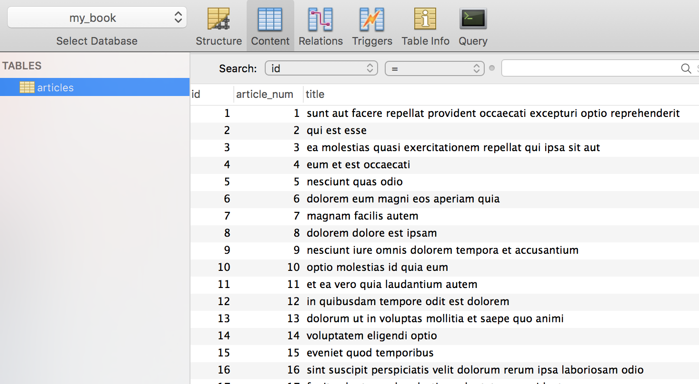

# read_api_save_into_mysql_db

## Objective:
* Create a database and table.
* Read json-api and store it into mysql database.

## How to run.
### Step 1:
Install requirements.txt

$pip install -r requirements.txt

### Step 2:
We need to establish a connection with mysql database. Use your own credentials.

### Step 3:
Demo api:
https://jsonplaceholder.typicode.com/posts

### Step 4:
If you want tot use json file instead of an api, sample json file.

### Step 5:
Example:

db_name = "my_book"

table_name = "articles"

Call the function:

create_db(db_name="my_book", table_name="articles")

Run $ python read_json_api.py from command line. 

## End Result.

